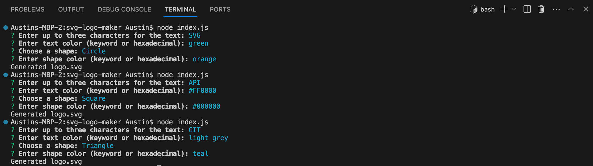
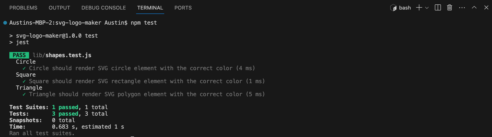

# SVG Logo Maker

[](https://opensource.org/licenses/MIT)

## Description
The SVG Logo Maker is a Node.js command-line application that enables users to generate a simple logo for their projects. The application prompts users to enter text (up to three characters), choose a text color, select a shape (circle, square, or triangle), and specify the shape's color. It then creates an SVG file named `logo.svg` with the provided specifications.

## Table of Contents
- [Installation](#installation)
- [Usage](#usage)
- [License](#license)
- [Contributing](#contributing)
- [Tests](#tests)
- [Questions](#questions)

## Installation
Before using the SVG Logo Maker, ensure that you have Node.js installed on your machine.

### Check Node.js Installation
Check if you have Node.js installed by following these steps:

1. Open your terminal.
2. Run the following command:
    ```bash
    node -v
    ``` 
    If Node.js is installed, you will see a version number, for example: ` v20.10.0 `

### Install Node.js (if not already installed)
If you don't have Node.js installed, follow these steps:

1. To install Node.js, visit the official [Node.js](https://nodejs.org/) website and download the recommended version for your operating system.
2. Follow the installation instructions provided on the Node.js website.

### Continue with SVG Logo Maker Installation
Once Node.js is installed, you can proceed with the installation of the SVG Logo Maker by following these steps:

1. Clone the repository to your local machine.
2. Open your terminal and navigate to the project directory.
3. Run the following command to install the required dependencies:
    ```bash
    npm install
    ```
Now you're ready to use the SVG Logo Maker!

## Usage
To use the SVG Logo Maker, follow these steps:

1. Open your terminal and navigate to the project directory.
2. Run the following command:
    ```bash
    node index.js
    ```
3. Answer the prompts to provide information about your logo, including text (up to three characters), text color, shape (circle, square, or triangle), and shape color.
4. Once you've answered all the prompts, the `logo.svg` file will be generated in the root of your project.

### Screenshots



## License
This application is covered by the [MIT](https://opensource.org/licenses/MIT) license.

## Contributing
If you want to contribute to this project, follow these steps:

1. Fork the repository.
2. Create a new branch for your feature or bug fix.
3. Make your changes and commit them with descriptive commit messages.
4. Push your changes to your branch.
5. Submit a pull request, explaining your changes.

## Tests
To run tests for the SVG Logo Maker, use the following command:
```bash
npm test
```

## Questions
If you have any questions, please contact [kyoriku](https://github.com/kyoriku) or email at devkyoriku@gmail.com.